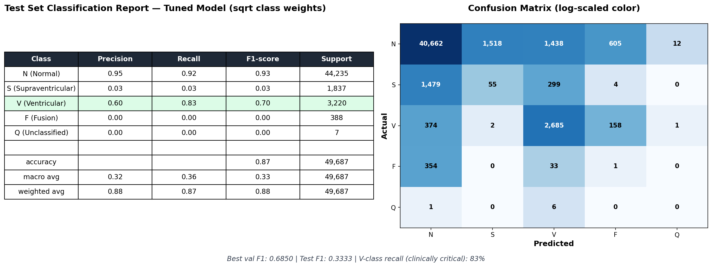
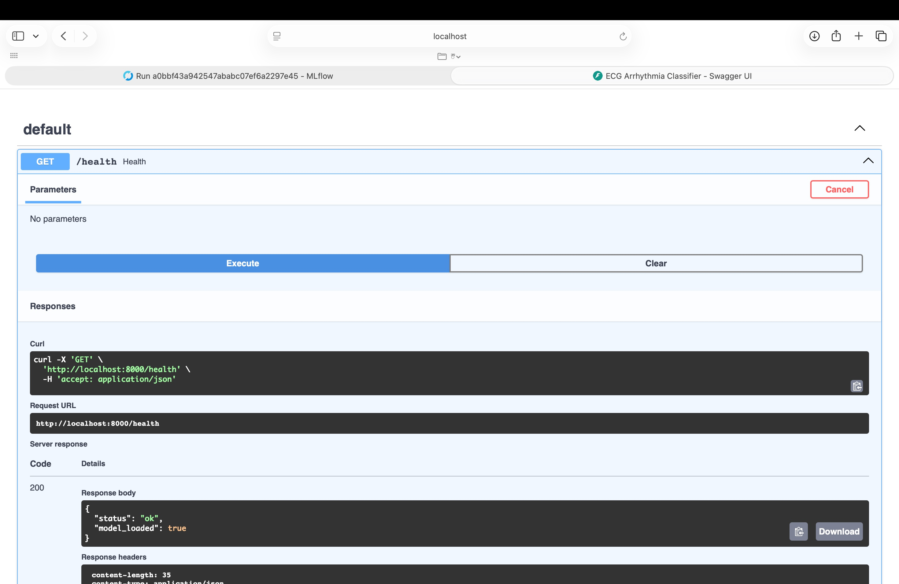
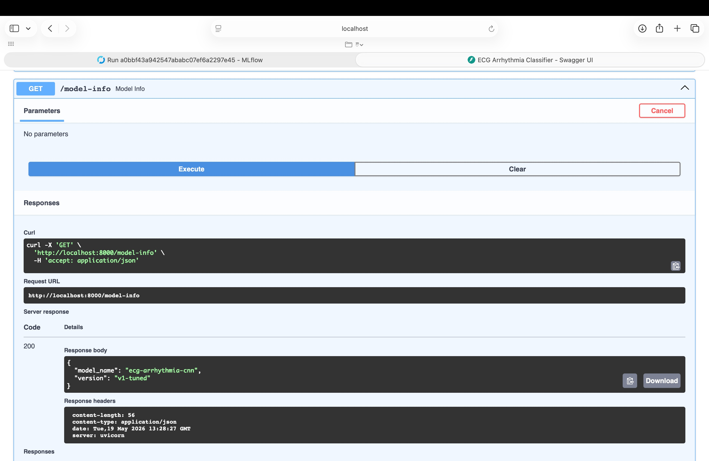

# ECG Arrhythmia Detection

A deep learning model that classifies heartbeats from ECG signals into 5 types, with the full MLOps pipeline around it — experiment tracking, model registry, API serving, and Docker.

I built this because most ML portfolio projects stop at a Jupyter notebook with `model.fit()` and an accuracy number. The interesting part isn't the model — it's everything you have to build around the model to actually ship it. So that's what this is.

## Results

Trained on the MIT-BIH Arrhythmia Database. Using the standard patient-level DS1/DS2 split (so test patients are never seen in training).



| Class | Precision | Recall | F1 | Support |
|---|---|---|---|---|
| N (Normal) | 0.95 | 0.92 | 0.93 | 44,235 |
| S (Supraventricular) | 0.03 | 0.03 | 0.03 | 1,837 |
| V (Ventricular) | 0.60 | **0.83** | 0.70 | 3,220 |
| F (Fusion) | 0.00 | 0.00 | 0.00 | 388 |
| Q (Unclassified) | 0.00 | 0.00 | 0.00 | 7 |
| Accuracy | | | 0.87 | 49,687 |

The V (ventricular) class is the one that actually matters clinically — missing a ventricular ectopic beat is much worse than a false alarm. I got 83% recall on it.

S and F classes underperform. That's a known issue with single-lead, single-beat classification on this dataset — most published work that does better uses RR-interval features and residual architectures. Documented in `docs/design-decisions.md`.

## What I had to figure out

**First training run was bad.** The class weights were too aggressive — the model was over-predicting minority classes everywhere. Got it from the confusion matrix: row 1 showed 8,000+ Normal beats being misclassified as something else. Switched to square-root scaling on the class weights, retrained. Normal-class F1 went from 0.87 to 0.93, kept V-class recall at 83%. Both runs logged in MLflow so the comparison is auditable.

**Patient-level splits matter.** A random split puts beats from the same patient in train and test. Most papers using random splits report 99%+ accuracy. Use a proper patient-level split (Chazal DS1/DS2) and you get 85-90%. The first one isn't generalizing, the second one is.

## The stack

- **Model:** 1D CNN in PyTorch, ~44K params, runs on CPU
- **Tracking:** MLflow, with the Model Registry as source of truth for what's deployed
- **Serving:** FastAPI with auto-generated docs at `/docs`
- **Container:** Docker, multi-stage build
- **Monitoring:** Evidently for drift detection
- **Demo:** Streamlit on Hugging Face Spaces

Inference latency: ~16ms per beat on a Mac Air CPU. Docker adds ~13ms overhead, still under 30ms total.

## API

FastAPI service with auto-generated Swagger docs. Three endpoints: `/health`, `/model-info`, `/predict`.

Health check responding with a loaded model:



Model info endpoint returning current served version:



## Running it

```bash
python -m venv venv && source venv/bin/activate
pip install -r requirements.txt

python scripts/download_data.py
python scripts/preprocess.py

mlflow ui --port 5000 &
python scripts/train.py --config configs/cnn_baseline.yaml

# Serve locally
uvicorn src.inference.api:app --host 0.0.0.0 --port 8000

# Or in Docker
docker build -t ecg-api -f docker/Dockerfile .
docker run -p 8000:8000 ecg-api
```

## Live demo

Deploying to Hugging Face Spaces next.

## What I deliberately didn't do

- Kubernetes — Docker alone is enough to show the containerization pattern
- A/B testing infra, multi-region failover — out of scope for a portfolio project
- FHIR/HL7 integration — would matter for real hospital deployment
- FDA validation — this is a research demo, not a medical product

## Data

[MIT-BIH Arrhythmia Database](https://physionet.org/content/mitdb/) from PhysioNet. 48 half-hour two-channel ECG recordings, 360 Hz sampling rate, beats annotated by cardiologists.
